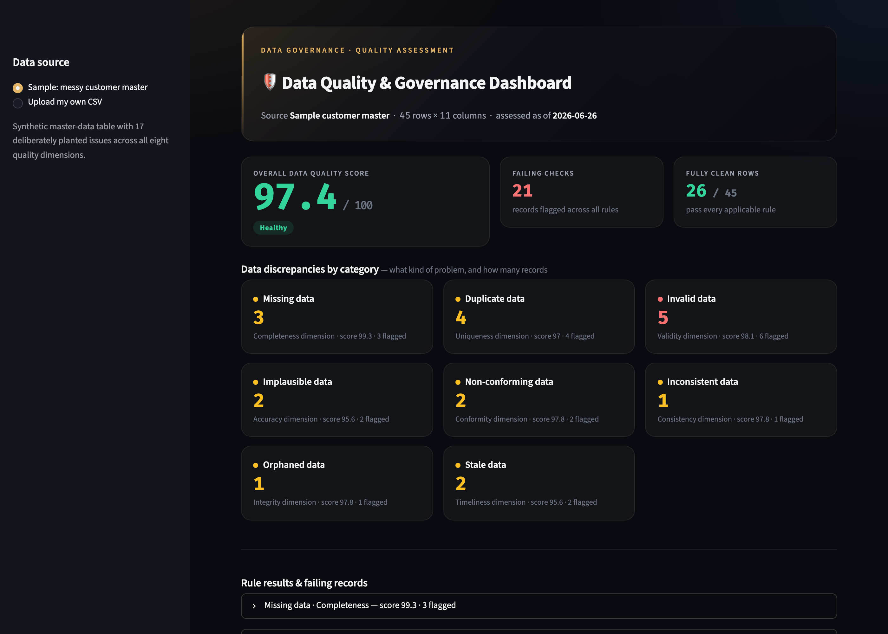
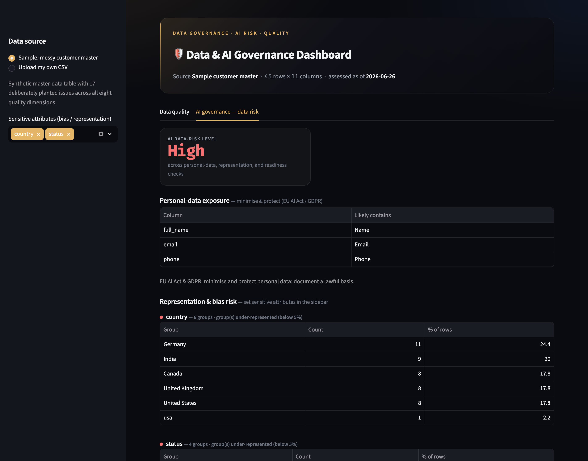

# 🛡️ Data & AI Governance Dashboard

Score any dataset across the **eight standard data-quality dimensions**, then run an **AI-governance data-risk assessment** — personal-data (PII) exposure, representation / bias risk, and AI-readiness — mapped to the **NIST AI Risk Management Framework** and the **EU AI Act**.

> **Live demo:** **https://data-governance-dashboard-gcsduhxqjh4dly9c8tzwqg.streamlit.app/**
> **Built with:** Python · pandas · Streamlit · pytest — **no external APIs, no keys; your data never leaves the app.**

---

## Why this exists

Bad master data quietly breaks reporting, billing, compliance, and analytics. Governance teams manage it by measuring data against a small number of well-understood **quality dimensions** and tracking a score over time. This tool makes that measurement concrete and interactive: point it at a CSV and it tells you *how good the data is, where it breaks, and which rows to fix first*.

## What it does

- **Scores eight dimensions** and rolls them into one weighted **Data Quality Score (0–100)**:

  | Dimension | Example rules |
  |---|---|
  | **Completeness** | Required fields are populated |
  | **Uniqueness** | No duplicate keys or duplicate records |
  | **Validity** | Emails, phones, numbers, and dates are well-formed; no future-dated events |
  | **Accuracy** | Values are plausible / within reasonable ranges (e.g. age 18–100) |
  | **Conformity** | Values come from an approved set (e.g. country, status) |
  | **Consistency** | Cross-field logic holds (e.g. `last_active ≥ signup`) |
  | **Integrity** | Referenced records exist (referential integrity) |
  | **Timeliness** | Records are fresh, not stale |

- **Profiles every column** — type, null %, uniqueness, sample values.
- **Drills into failures** — pick any failing rule and see the exact offending rows.
- **Exports a quality report** as CSV for sharing or tracking over time.
- **Works on your own data** — upload any CSV and the tool infers a conservative rule set automatically; or use the bundled sample to see the full, hand-authored governance rule set in action.
- **Assesses AI / model data-risk** (AI-governance tab) — flags personal-data (PII) exposure, tests chosen sensitive attributes for representation / bias, and surfaces AI-readiness gaps, each mapped to the NIST AI RMF and EU AI Act.

## Screenshots



Data-quality tab: the overall score, discrepancy categories (missing / duplicate / invalid / implausible / non-conforming / inconsistent / orphaned / stale), per-rule results, and row-level drill-down.



AI-governance tab: personal-data exposure, representation / bias risk, and AI-readiness, each mapped to the NIST AI RMF and EU AI Act.

## Quickstart

```bash
git clone https://github.com/adeebansar/data-governance-dashboard.git
cd data-governance-dashboard

python3 -m venv .venv && source .venv/bin/activate      # Windows: .venv\Scripts\activate
pip install -r requirements.txt

streamlit run app.py
```

Regenerate the sample dataset (optional):

```bash
python sample_data/generate_sample.py
```

## Testing

The rule engine is covered by unit tests that validate it against a sample dataset with **known, planted issues** — so every dimension is checked against ground truth. A smoke test boots the Streamlit app headlessly.

```bash
python -m pytest -q
```

## How it's built

```
app.py                 # Streamlit UI (presentation only)
data_quality.py        # Pure-function rule engine + column profiling
rules_config.py        # Declarative rules: rich schema for the sample + auto-inference for any CSV
sample_data/           # Synthetic 'messy customer master' + its generator
tests/                 # Engine tests (ground-truth) + app smoke test
```

The engine is deliberately separated from the UI: every check is a pure function returning plain data, which keeps it testable and reusable (a CLI or scheduled job could call the same engine).

## License

MIT — see [LICENSE](LICENSE).
